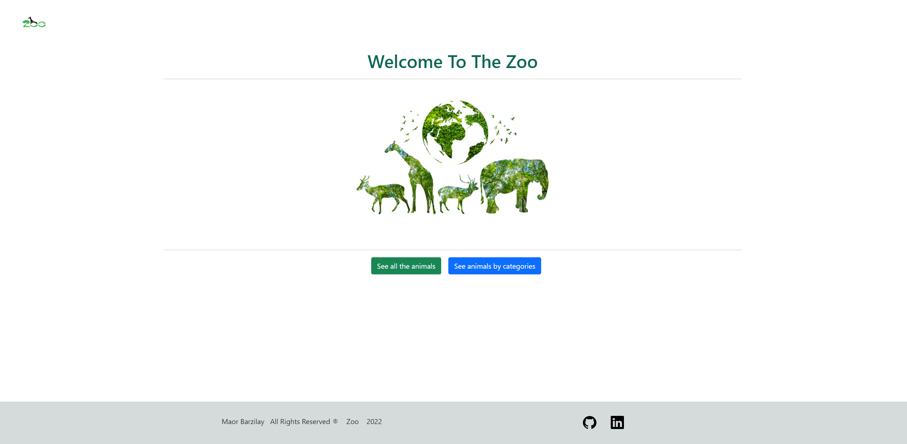
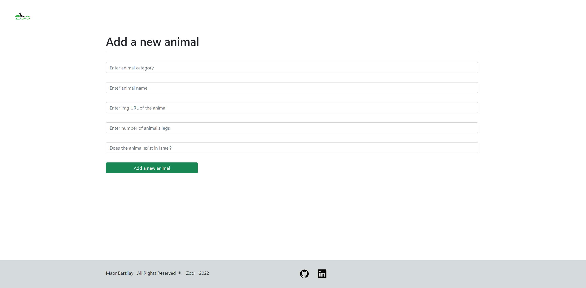
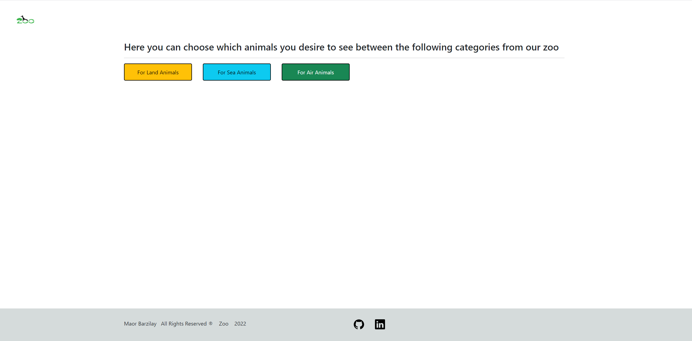
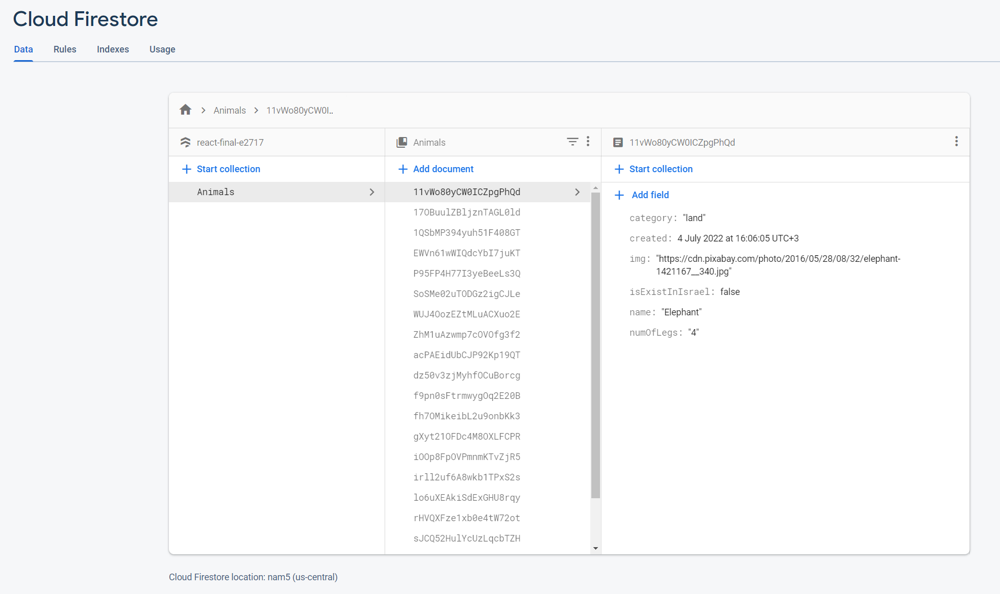

<h1>React Zoo App</h1>

<h1>Teachnologies:</h1>
<h3>Javascript</h3>
<h3>React</h3>
<h3>HTML</h3>
<h3>CSS</h3>
<h3>Bootstrap</h3>
<h3>Firebase - Firestore</h3>

<h1>In this app you can see all the animals in the web zoo, you can edit, delete and add animals</h1>

<h1>Homepage</h1>

<h1>Animals list (You can also press on "Add animal" button to redirect to the add animal screen)</h1>

<h1>Animals list - 2</h1>

<h1>Animals list - 3</h1>

<h1>Add animal</h1>

<h1>Animals by category</h1>

<h1>Firebase - Firestore</h1>

 
 
<h1>Thank You !</h1>